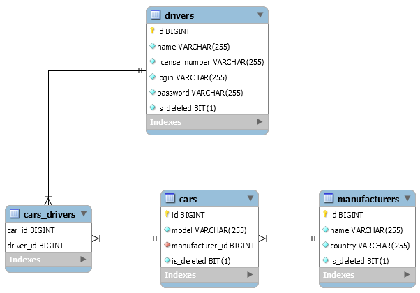

# :oncoming_taxi: Taxi Service :oncoming_taxi:

Simple web app, where you can manage taxi data.

## :star: Features  

* Login/logout as driver
* Add/Delete/Get:
  * drivers
  * cars
  * manufacturers
* JSP UI

## :computer: Technologies
* JDK 11
* Apache Maven
* JDBC
* MySQL 8
* Tomcat 9
* JSTL
* JSP
* Servlet API

## :clipboard: Project structure

The project is divided into several levels:
 * Presentation tier: UI is represented by a JSP, translated into a Java servlet/Controller and executed on the server.
 * Logic tier: business logic service classes that move and process data between the data and presentation layers.
 * Data tier: data store/retrieve layer.

### 🖼️ DB/Model structure

## 🛠️ Setup guide

You can find setup guide in guthub [wiki](https://github.com/tuturox91/Cinema-Service/wiki/Start-work-with-project "wiki").
   
